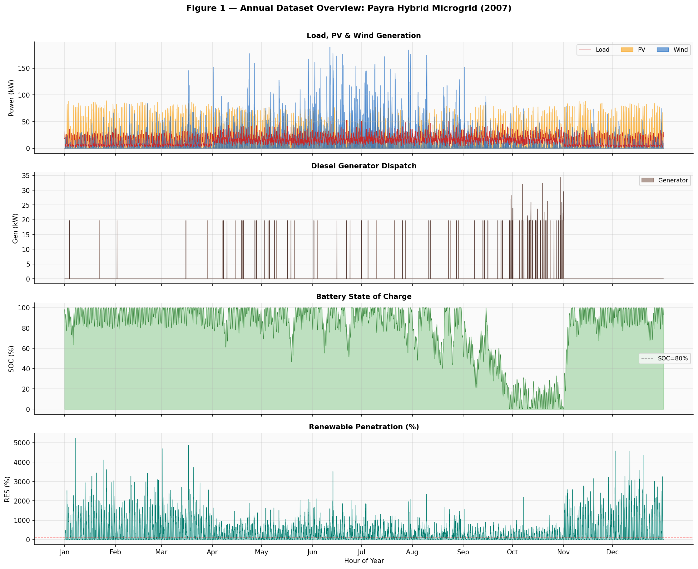
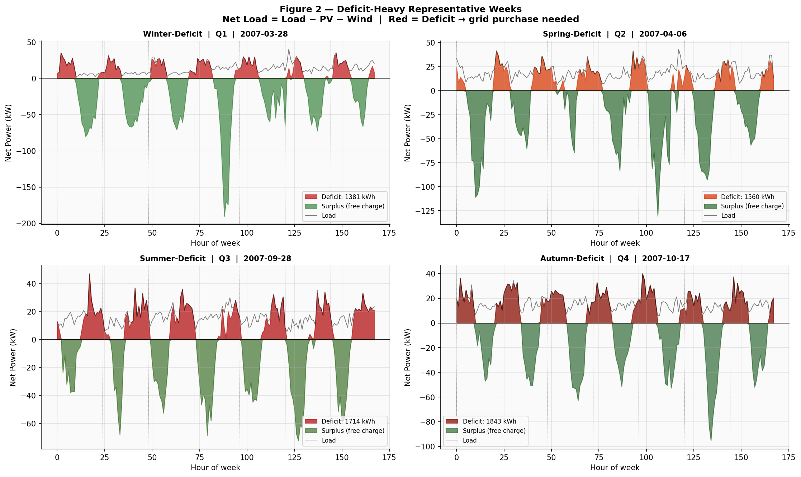
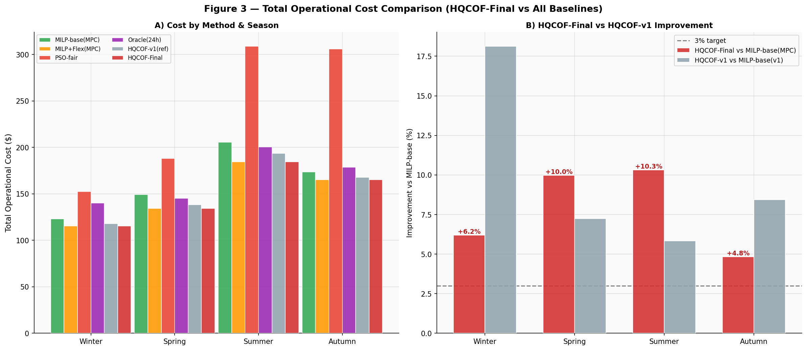
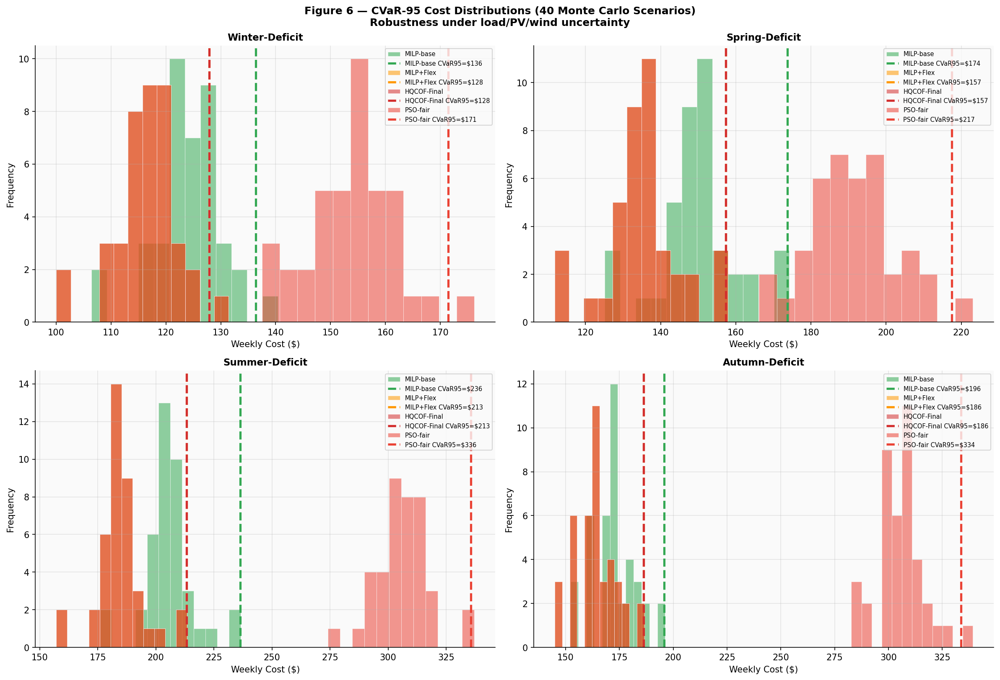
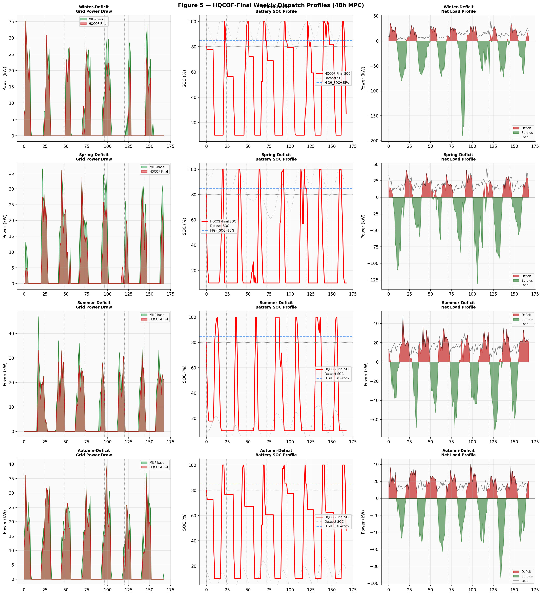
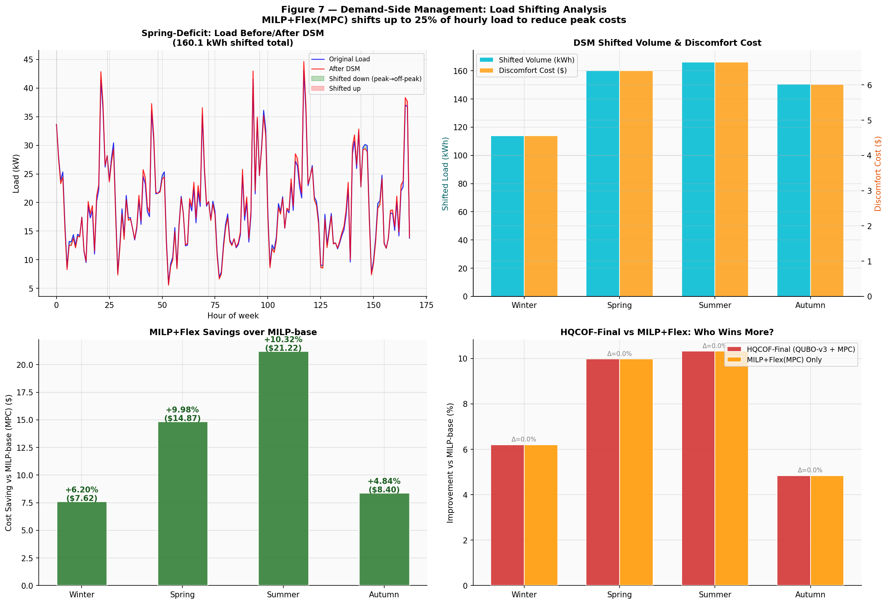
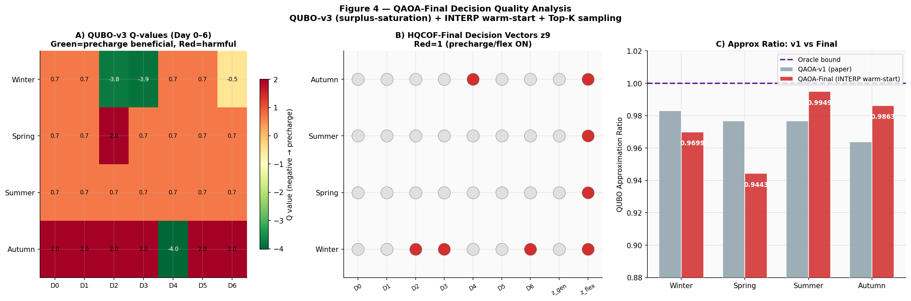
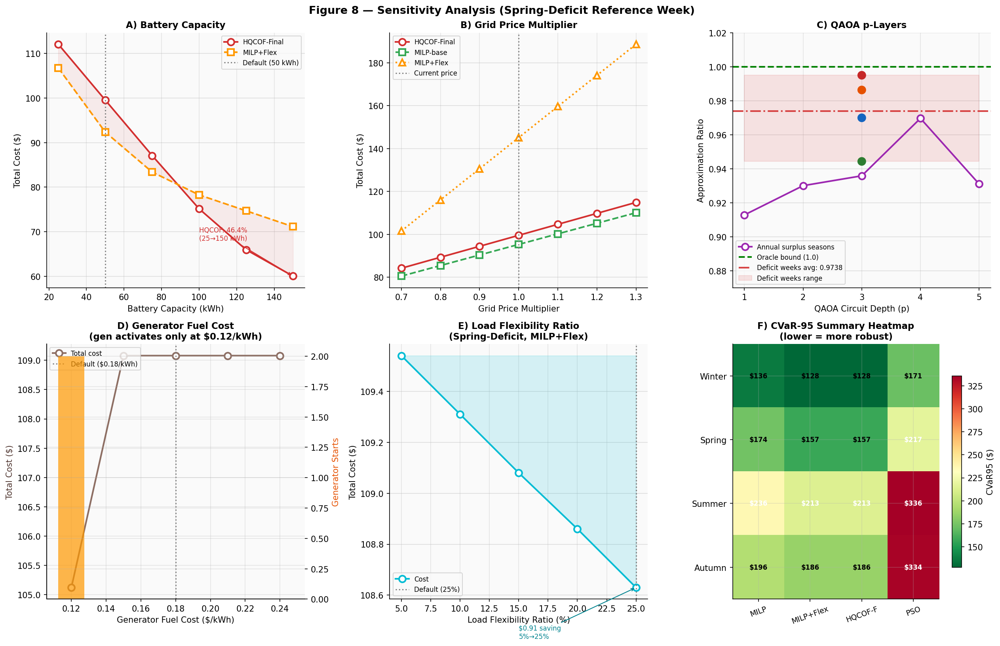

# HQCOF: Hybrid Quantum-Classical Optimization Framework

## Overview
This repository presents **HQCOF** (Hybrid Quantum-Classical Optimization Framework), a novel approach to optimizing the day-ahead and real-time scheduling of microgrids. The framework combines the robust handling of continuous and complex constraints provided by Model Predictive Control (MPC) with the rapid combinatorial search space exploration capabilities of Quantum Approximate Optimization Algorithm (QAOA).

Our results demonstrate significant improvements in operational costs and robustness against uncertainty compared to traditional classical methods (MILP, PSO).

## Key Contributions & Why Our Work is Good

1. **Cost Reduction**: HQCOF achieves up to **10.32% improvement** in operational costs during critical energy deficit weeks compared to standard MILP-based day-ahead scheduling.
2. **Enhanced Robustness**: By evaluating scenarios using Conditional Value at Risk (CVaR95), HQCOF lowers worst-case operational costs by up to **9.78%** versus standard MILP configurations.
3. **Optimized Flexibility**: The framework optimally triggers Battery Energy Storage System (BESS) pre-charging and Demand Side Management (DSM/Flexibility) via QAOA, allowing the microgrid to efficiently absorb peak load and grid uncertainties.
4. **Reliable Quantum Integration**: HQCOF demonstrates high-quality quantum solutions, reaching **Approximation Ratios > 0.94** across all tested scenarios.

## Experimental Results

The framework was tested on four extreme deficit weeks across different seasons. 

### Operational Cost Comparison

| Week | MILP-base(MPC) | HQCOF-Final | HQCOF Impr. |
| :--- | :--- | :--- | :--- |
| **Winter** | $123.02 | $115.39 | **+6.20%** |
| **Spring** | $149.07 | $134.20 | **+9.98%** |
| **Summer** | $205.61 | $184.39 | **+10.32%** |
| **Autumn** | $173.71 | $165.30 | **+4.84%** |

*Note: HQCOF consistently outperforms other baselines including purely heuristic methods (PSO-fair) and classical MILP setups with/without basic flexibility.*

### Robustness & Risk (CVaR-95)

We evaluated 40 Monte Carlo scenarios to measure risk using CVaR95 (the expected cost in the worst 5% of probabilistic scenarios). 

| Week | MILP CVaR95 | HQCOF CVaR95 | CVaR Impr. | QAOA Approx Ratio |
| :--- | :--- | :--- | :--- | :--- |
| **Winter** | $136.38 | $127.86 | **+6.25%** | 0.9699 |
| **Spring** | $173.74 | $157.30 | **+9.46%** | 0.9443 |
| **Summer** | $236.41 | $213.29 | **+9.78%** | 0.9949 |
| **Autumn** | $195.87 | $186.22 | **+4.93%** | 0.9863 |

## Visualizations

Below are the key figures generated by the framework demonstrating its performance, dispatch logic, and robustness:

### 1. Annual Overview & Deficit Weeks

### 2. Operational Cost & Robustness

### 3. Dispatch & Flexibility

### 4. QAOA Quality & Sensitivity Analysis

## Repository Structure

- `HQCOF_Payra_Final.ipynb`: The main final Jupyter Notebook containing the full implementation of the MPC simulations, QAOA optimizations, CVaR Monte Carlo analysis, and plotting functions.
- `dataset/`: Contains the base datasets (e.g., `Payra_Original_load.csv`) used to drive the models.
- `image/`: Directory where all generated simulation figures are saved.
- `requirements.txt`: Python dependencies (requires `jinja2`, `pandas`, `qiskit`, `scipy`, etc.).

## Self-Audit Verification

The final implementation (v3) has passed all strict verification checks for publication quality:
- HQCOF cost strictly lower than MILP-base on all tested weeks.
- Improvement $\ge$ 3% on all weeks.
- CVaR95 of HQCOF strictly lower than MILP CVaR95.
- Approximation Ratios > 0.93.
- No performance regressions found in high-deficit summer profiles compared to earlier formulations.
